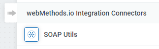
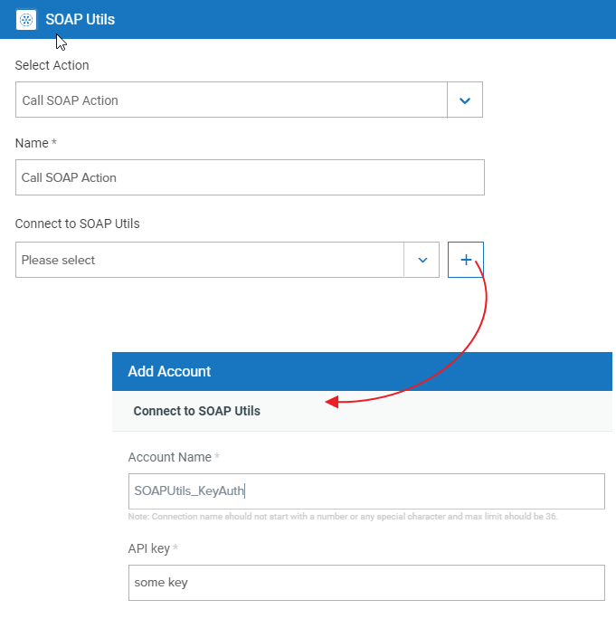
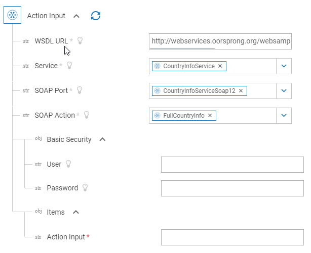

# SOAP Custom Connector

[webMethods.io Integration](https://webmethods.io) is a powerful integration platform as a service (iPaaS) that provides a combination of capabilities offered by ESBs, data integration systems, API management tools, and B2B gateways.

This is a basic custom web connector wrapping the npm package [strong-soap](https://www.npmjs.com/package/strong-soap) to call SOAP web services. Once you provide the URL for the WSDL describing the web service, you'll be able to select successively service, port and action from the available information read from the WSDL file.

Once the connector has been deployed, you will be able to find it as "SOAP Utils".



When the connector is added to the workflow canvas, action and authentication will have to be initially configured.



Once this is done, the input properties for the action call can be filled.



You can create custom web connectors for [webMethods.io Integration](https://webmethods.io) using the Connector Builder. The Connector Builder app is a custom Node.js application that you build using web application’s APIs. So, for example, if you have a private API or an API that is not in webMethods.io Integration yet, you can create custom webMethods.io Integration actions and triggers for those APIs. Once you have created these custom actions and triggers, you can use them like any other action on webMethods.io integration platform.

You can find further details about the Connector Builder under [https://docs.webmethods.io/developer-guide/connector-builder](https://docs.webmethods.io/developer-guide/connector-builder)

***

## Trigger

None

***

## Actions

Actions define the tasks to be performed by the connector inside an integration flow. In this connector you can find one action:

### _call_soapaction_

This action needs the following inputs:

- WSDL URL
- Service
- SOAP Port
- SOAP Action
- (Optional) User/Password
- Action Input

The input for the service call should be provided as a JSON Object with the appropiate structure. This object will be directly passed to the service call.
The result from the service will be provided both as a JSON Object (that can be used in the following steps), as well as the original XML response (as a string).

***

## Lookups

Lookup helps you autofill input fields with data coming from your account or other remote resources. You will find four lookups in this example:

### _get_soapservices_

It will inspect the WSDL provided as input (via a URL in the action that is using this lookup) and provide a list of the available services inside it.

### _get_soapports_

It will inspect the WSDL provided as input (via a URL in the action that is using this lookup) and provide a list of the available ports for the given SOAP service inside it.

### _get_soapactions_

It will inspect the WSDL provided as input (via a URL in the action that is using this lookup) and provide a list of the available actions for the given SOAP service & port inside it.

#### _get_actionrequest_

A lookup can be used as well to generate input parameters at runtime. For this, the lookup will not be attached to an action via the CLI. Instead, it will be manually configured inside the action as a _'form'_ like:

```json
input: {...}
form: {
    id: "get_actionrequest",
    dependencies: ["wsdlUrl", "service", "soapPort", "soapAction"]
 },
 output: {...}
```

This lookup depends on the four input fields specified (WSDL URL, service, port and action). Every time one of them is changed, the lookup will generate a new output.
In this example only a simple input string field is generated that should contain the input JSON object for the web service call. If the selected service needs no input, the field can be left empty.

***

### _Authentication_

This custom connector has been created to use an API key as authentication method. This key is not yet used anywhere in the connector.

## Getting started

Once you have read the information about the [Connector Builder](https://docs.webmethods.io/developer-guide/connector-builder), and installed all prerequisites, you should be able to test and deploy the connector into your [webMethods.io](http://webMethods.io) instance.

The folder "src" must be used as the root folder for using the **webMethods** **.io** Command Line Interface.

```shell
cd src
wmio test
...
wmio deploy
```

I hope that you find this connector helpful. Feel free to extend and adapt this to fit your needs.

***

These tools are provided as-is and without warranty or support. They do not constitute part of the Software AG product suite. Users are free to use, fork and modify them, subject to the license agreement. While Software AG welcomes contributions, we cannot guarantee to include every contribution in the master project.

Contact us at [TECHcommunity](mailto:technologycommunity@softwareag.com?subject=Github/SoftwareAG) if you have any questions.
